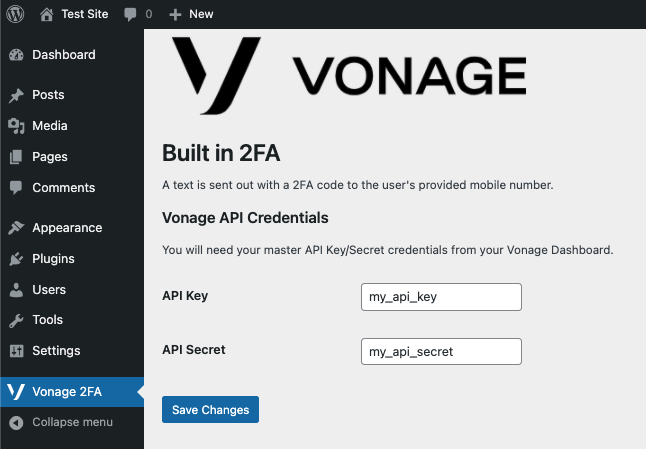
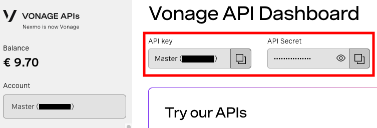
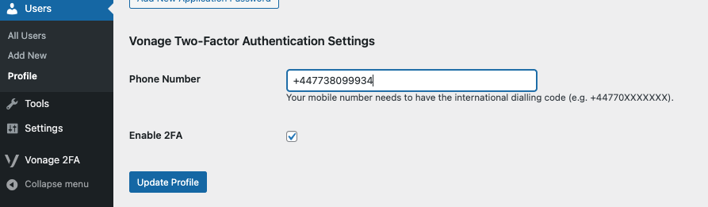
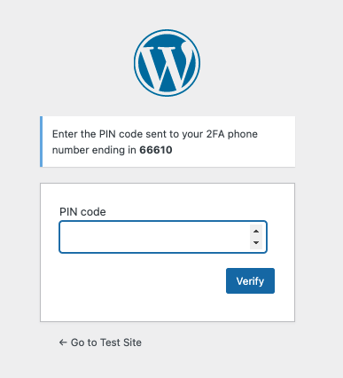

# Vonage Two-Factor Authentication Plugin for WordPress

This plugin enables your WordPress site to use Two-Factor Authentication
using Vonage's Verify API service.

### Requirements: 
* WordPress Version 5.9 and up (i.e. the current supported version of WordPress).
* An account with Vonage (with credit). You can sign up [here](https://dashboard.nexmo.com/sign-up).

### Setting up:

1. Install this plugin in your WordPress plugins directory.
2. Active the plugin under your administrator account.
3. Your 2FA admin menu should now be accessible from the WordPress menu:

4. Populate your API Key and Secret in order to connect to Vonage's [Verify API]() that
this plugin uses. You can get these credentials from your [Vonage Dashboard](https://dashboard.nexmo.com/), located here:

5. Each user of your WordPress site can now enable 2 Factor Authentication from their
user settings. A new section is available in the Profile screen, which will look like this:

> Please note that this phone number must contain the *full* international dialling code
> complete with + symbol.

6. For users with 2FA enabled, the first login attempt will ask for the PIN sent out
to the phone number entered:

7. Once the user has entered a valid PIN, login will finish.

> Under the hood, WordPress stores a unique `request_id` from Vonage in the user's
> session with the key `vonage_2fa_request_id`. On each login, WordPress
> will use the Verify API to make sure this key is still valid. When it expires, the 2FA
> workflow will be repeated.
 
### Feedback and Support

Got any questions? Fire me an email or DM. You can find me [here](https://twitter.com/SecondeJ) on Twitter,
or by email you can reach me at jim.seconde at vonage.com. Alternatively, you
can email the Developer Relations team at devrel at vonage.com.